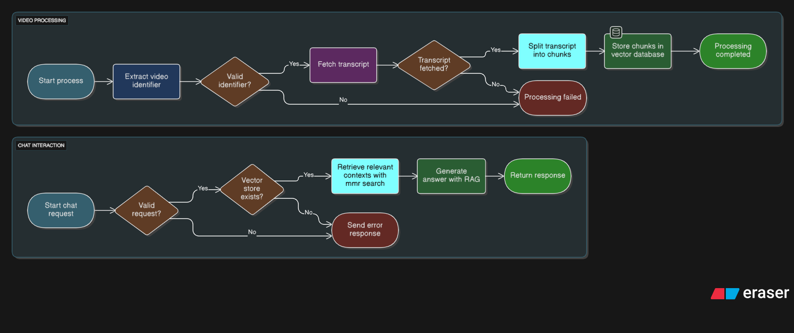

# YouTube Video Chatbot

A Chrome extension and backend service that lets you chat with YouTube videos using AI. Ask questions about the content of any YouTube video and get instant answers powered by OpenAI and Pinecone.

---
<p align="center">
  
</p>

## Features

- **Chat with YouTube videos**: Ask questions about any YouTube video and get context-aware answers.
- **Automatic transcript processing**: The extension fetches and processes video transcripts for accurate responses.
- **AI-powered answers**: Uses OpenAI's GPT models and Pinecone vector search for relevant, accurate replies.
- **Seamless integration**: Works directly on YouTube via a popup or injected chat button.

---

## Architecture

- **Frontend**: Chrome extension (popup UI, content script)
- **Backend**: Node.js/Express API with LangChain, OpenAI, and Pinecone integration

---

## Setup

### Prerequisites

- Node.js (v18+ recommended)
- Chrome browser
- OpenAI API key
- Pinecone API key

### 1. Clone the repository

```bash
git clone https://github.com/Venu005/youttube-chat-bot.git
cd youtube-video-chatbot
```

### 2. Backend Setup

```bash
cd backend
cp .env.example .env   # Edit .env with your API keys and config
npm install
npm run dev            # or: npm start
```

The backend runs on `http://localhost:3000` by default.

### 3. Extension Setup

1. Open Chrome and go to `chrome://extensions/`
2. Enable "Developer mode"
3. Click "Load unpacked" and select the `extension` folder in this repo

---

## Usage

1. Go to any YouTube video page.
2. Click the chatbot icon in the extension bar or use the injected chat button below the video.
3. Wait for the transcript to process (first time only).
4. Ask questions about the video content!

---

## Development

- **Backend**: Located in `/backend`
  - Main entry: `server.js`
  - API routes: `/controllers/chatbot.js`
  - Services: `/services`
- **Extension**: Located in `/extension`
  - Popup UI: `/popup`
  - Content script: `/content`
  - Background: `/background`

### Environment Variables

See `/backend/.env.example` for required variables:

- `OPENAI_API_KEY`
- `PINECONE_API_KEY`
- `PINECONE_INDEX`
- `PORT`
- `ALLOWED_ORIGINS`

---

## Troubleshooting

- Make sure your API keys are correct and have sufficient quota.
- The backend must be running for the extension to work.
- If transcript processing fails, the video may not have subtitles available.

---

## License

MIT License

---

## Credits

- [LangChain](https://github.com/langchain-ai/langchainjs)
- [OpenAI](https://openai.com/)
- [Pinecone](https://www.pinecone.io/)
